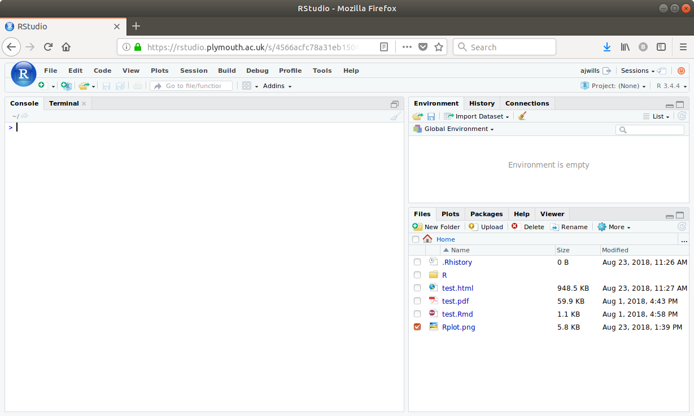

# Introduction to R Studio"
_Andy Wills_

## Getting RStudio
Before you can use RStudio, you have to get it on to your computer. Here's how:

**Plymouth University computer room** - RStudio is already on these machines. Skip to __Running RStudio__, below.

**Web browser** - You can use RStudio through a web browser on any laptop or desktop, anywhere in the world that has a good internet connection. Go to [www.ronline.org](http://www.ronline.org) and log on. You can request a free account from a demonstrator in class, and you'll get one immediately. Outside class, email andy@willslab.co.uk. If emailing, allow two working days for a response.

**Install on your own machine** - Alternatively, you can install RStudio on your own machine. It's completely free, and will probably take around 30 minutes. Follow these [step-by-step instructions](install-rstudio.html).

## Running RStudio
You run RStudio like you would run any other application (e.g. Word). You'll be greeted with a screen that looks something like this:

When you open RStudio for the first time, you can see three parts: 

1. The **Console** - This is the large rectangle on the left. This is where you tell R what to do, and it's also where R prints the answers to your questions. 

2. The **Environment** - This is the rectangle on the top right. This is where R keeps a list of the data it knows about. It's empty at the moment, because we haven't given R any data yet.

3. The **Files** - This is the rectangle on the bottom right. This is a bit like the _File Explorer_ in Windows, or the _Finder_ on a Mac. It shows you what files and folders R can see.

You should also be able to see that the two rectangles on the right have a number of other "tabs". These work like tabs on a web browser.  

The top rectangle has the tabs "Environment" and "History". The **History** tab keeps a record of commands you've recently typed into the Console. This can sometimes be useful.

The bottom rectangle has the tabs "Files", "Plots", "Packages", "Help", and "Viewer". We'll cover what these other tabs do later on. 

___

This material is distributed under a [Creative Commons](https://creativecommons.org/) licence. CC-BY-SA 4.0. 

____

_version: 0.2_
