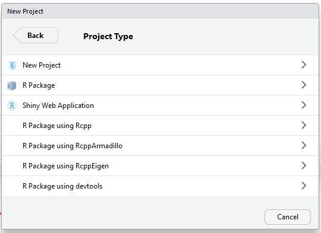

# Using RStudio
_Andy Wills_

A big part of psychology is collecting data about people, visualizing it (graphs etc.), and drawing conclusions. RStudio, like Excel, is computer software that helps us to do that. RStudio is rapidly becoming the standard tool for serious data analysis in psychology, because it's powerful, relatively easy to use, and free. In these series of worksheets, you'll learn the basics of how to use it.

## Getting started

Open a web browser (e.g. [Firefox](https://www.mozilla.org/en-US/firefox/new/), Safari, Chrome, _not_ Edge) and go to a <a href = "https://rstudio.plymouth.ac.uk" target = "blank">RStudio server</a>. Log on, using the username and password you have been given. 

If that works, you should see something like this:

We'll go through what it all means in a bit. But, first, we're going to...

## Create a new project

RStudio uses _projects_ to help you keep your work organized, and to make sure you have a record of your analyses. You should start a new project each time you start a new module in your degree (possibly more frequently, but we'll come back to that later). Here's how to create a new project:

1. At the top right of RStudio, you will see a little blue cube, with the text "Project: (none)". Click on this, and select "New project". 

2. Now click "New Directory"

3. Now click "New Project"

4. Next, type in a name for the project that makes sense to you in the "Directory name" box. I've typed _psyc411_, but you should pick something more meaningful to you (e.g. _briefcourse_). Then click "Create project".

5. Now, create a _R script_. An R script is a record of the analyses you have done. You create an R Script by clicking on the white plus sign on a green background (see below), and then clicking on "R Script".

If everything worked well, your screen should now look like this:

You should be able to see four parts:

1. The **Script** window - This is the rectangle on the top left. This is where you will tell R what to do. It only does what you tell it.

2. The **Console** window - This is the rectangle on the bottom left. This is where R prints the answers to your questions.

3. The **Environment** window - This is the rectangle on the top right. It's where R keeps a list of the data it knows about. It's empty at the moment, because we haven't given R any data yet.

4.  The **Files** - This is the rectangle on the bottom right. This is a bit like the _File Explorer_ in Windows, or the _Finder_ on a Mac. It shows you what files are in your R project. 

That's it! You're all set to start learning how to analyse data in R.
